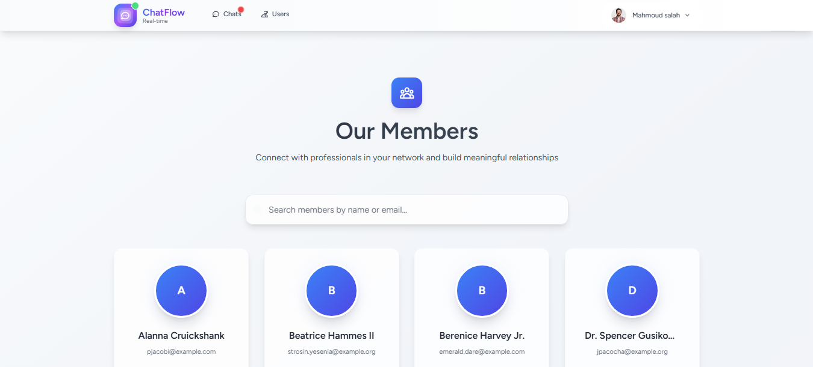
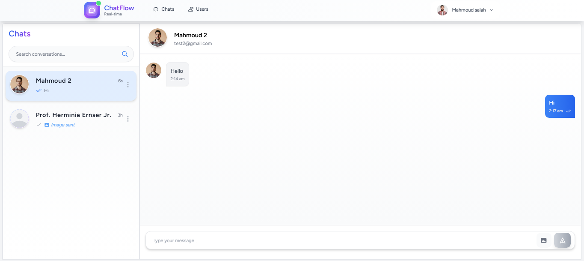

# 💬 Chat-Realtime

<div align="center">
  
  
  
  
  
  
</div>

<br>

<div align="center">
  <h3>🚀 A modern real-time chat application built with the TALL Stack</h3>
  <p><strong>Tailwind CSS</strong> • <strong>Alpine.js</strong> • <strong>Laravel</strong> • <strong>Livewire</strong> • <strong>Pusher</strong> • <strong>MySQL</strong></p>
</div>

---

## 📸 Preview

<div align="center">
  
  
</div>

---

## ✨ Features

<table>
  <tr>
    <td>
      <h4>⚡ Real-time Communication</h4>
      <p>Instant messaging powered by Pusher WebSockets</p>
    </td>
    <td>
      <h4>🔔 Smart Notifications</h4>
      <p>Sound alerts with customizable notification tones</p>
    </td>
  </tr>
  <tr>
    <td>
      <h4>💬 Seamless Experience</h4>
      <p>Chat without page refresh using Livewire magic</p>
    </td>
    <td>
      <h4>🖼️ Rich Media Support</h4>
      <p>Send and receive images in your conversations</p>
    </td>
  </tr>
  <tr>
    <td>
      <h4>🔐 Secure Authentication</h4>
      <p>Built on Laravel Breeze for robust security</p>
    </td>
    <td>
      <h4>📱 Fully Responsive</h4>
      <p>Perfect experience across all devices</p>
    </td>
  </tr>
</table>

---

## 🛠️ Tech Stack

<div align="center">
  <table>
    <tr>
      <td align="center" width="200px">
        <br>
        <strong>Laravel</strong><br>
        <em>Backend Framework</em>
      </td>
      <td align="center" width="200px">
        <br>
        <strong>Livewire</strong><br>
        <em>Dynamic Frontend</em>
      </td>
      <td align="center" width="200px">
        <br>
        <strong>Tailwind CSS</strong><br>
        <em>Styling Framework</em>
      </td>
    </tr>
    <tr>
      <td align="center" width="200px">
        <br>
        <strong>Alpine.js</strong><br>
        <em>JavaScript Framework</em>
      </td>
      <td align="center" width="200px">
       <br>
        <strong>Pusher</strong><br>
        <em>Real-time Engine</em>
      </td>
      <td align="center" width="200px">
        <br>
        <strong>MySQL</strong><br>
        <em>Database</em>
      </td>
    </tr>
  </table>
</div>

---

## 🚀 Quick Start

### Prerequisites

Before you begin, ensure you have the following installed:
- PHP 8.1 or higher
- Composer
- Node.js & npm
- MySQL
- A Pusher account (free tier available)

### Installation Steps

```bash
# 1️⃣ Clone the repository
git clone https://github.com/MahmoudSalah53/Chat-Realtime.git
cd Chat-Realtime
```

```bash
# 2️⃣ Install PHP dependencies
composer install
```

```bash
# 3️⃣ Install JavaScript dependencies
npm install && npm run dev
```

```bash
# 4️⃣ Environment setup
cp .env.example .env
php artisan key:generate
```

```bash
# 5️⃣ Database setup
# Configure your database in .env file, then run:
php artisan migrate
```

```bash
# 6️⃣ Start the queue worker
php artisan queue:work
```

```bash
# 7️⃣ Launch the application
php artisan serve
```

### 🔧 Configuration

1. **Database**: Update your `.env` file with your database credentials
2. **Pusher**: Add your Pusher credentials to the `.env` file:
   ```env
   PUSHER_APP_ID=your_app_id
   PUSHER_APP_KEY=your_app_key
   PUSHER_APP_SECRET=your_app_secret
   PUSHER_APP_CLUSTER=your_app_cluster
   BROADCAST_CONNECTION=pusher
   ```

---

## 🎯 Usage

1. **Register/Login**: Create an account or login with existing credentials
2. **Start Chatting**: Select a user and start your real-time conversation
3. **Send Media**: Click the image icon to share photos
4. **Customize Sounds**: Access settings to change notification tones
5. **Enjoy**: Experience seamless real-time communication!

---

## 🤝 Contributing

We welcome contributions! Please feel free to submit a Pull Request. For major changes, please open an issue first to discuss what you would like to change.

1. Fork the Project
2. Create your Feature Branch (`git checkout -b feature/AmazingFeature`)
3. Commit your Changes (`git commit -m 'Add some AmazingFeature'`)
4. Push to the Branch (`git push origin feature/AmazingFeature`)
5. Open a Pull Request

---

## 📄 License

This project is open source and available under the [MIT License](LICENSE).

---

## 👨‍💻 Author

**Mahmoud Salah**
- GitHub: [@MahmoudSalah53](https://github.com/MahmoudSalah53)

---

## 🙏 Acknowledgments

- Laravel Team for the amazing framework
- Livewire Team for making Laravel interactive
- Pusher for real-time capabilities
- All contributors and users of this project

---

<div align="center">
  <p>⭐ If you found this project helpful, please give it a star!</p>
  <p>Made with ❤️ by <a href="https://github.com/MahmoudSalah53">Mahmoud Salah</a></p>
</div>
